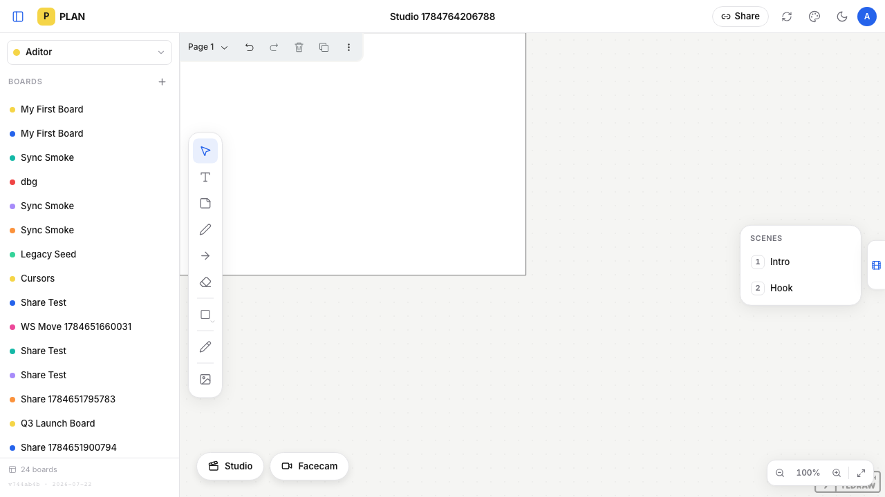
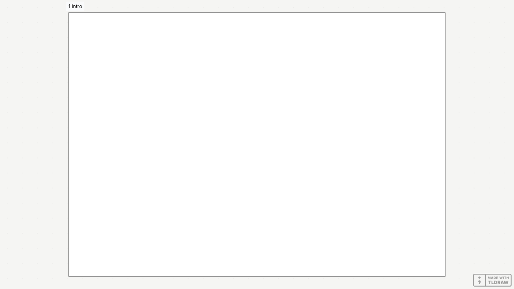
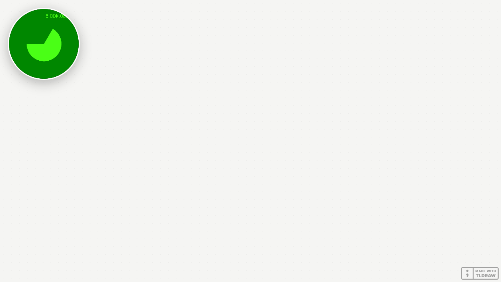

<!-- abnahme
repo: videoaditor/plan-app
branch: nacht/2026-07-23-v2-studio-mode
base: main
title: "V2.3 — Studio-Modus (Szenen, Recording-Bühne, Facecam)"
status: fertig
preview: none
preview_url: none
verify: "npx tsc --noEmit · npm run build · node scripts/smoke-scenes.mjs · npx playwright test (studio, facecam) · grep -ri parallax src/ (leer)"
-->

# V2.3 — Studio-Modus

Der Nordstern-Baustein: Ideen visualisieren und direkt darüber ein Screen-Share-YouTube-Video mit Facecam aufnehmen. Drei Tasks, alle gebaut und verifiziert. Kein Deploy (Policy — Alan deployt nach dem Review).

## Was & Warum
Der alte Present-Modus war ein Hack: er suchte Text-Shapes wie `#1` und wackelte per CSS-Parallax. Diese Schicht macht **Szenen aus Frames** (jeder Frame, dessen Name mit einer Zahl beginnt — „1 Intro", „2 Hook"), gibt ihnen ein Szenen-Panel am rechten Rand, und einen echten **Studio-Modus** (Taste `S`), der die komplette Oberfläche ausblendet und mit Pfeiltasten sanfte tldraw-Kamerafahrten zwischen den Szenen macht. Dazu eine **Facecam-Bubble** (runde, gespiegelte Webcam, an die Ecken snappend) — aufgenommen wird extern mit Screen Studio/QuickTime, die App liefert nur die perfekte Bühne.

## Tasks & Verifikation
- **T1 — Szenen-Engine + Panel.** `src/lib/scenes.mjs` (`getScenes`/`toScenes`/`zoomToScene`), `ScenePanel.tsx`. Der alte Marker-/Parallax-Code ist gelöscht (`PresentationMode.tsx` entfernt). → `node scripts/smoke-scenes.mjs` grün; Playwright: Klick auf Szene 2 bewegt die Kamera.
- **T2 — Studio-Modus.** `StudioMode.tsx` + `body.studio-mode`-CSS. `S` an/aus, Pfeile/Space Szenen, `L` Laser, `C` Facecam, `Esc` raus; Szenen-Zähler mit 2-s-Auto-Hide. → Playwright: `.tool-rail`/`.zoom-controls`/`header` nicht sichtbar; Pfeiltaste ändert die Kamera; Screenshot leeres Chrome.
- **T3 — Facecam-Bubble.** `FacecamBubble.tsx`: getUserMedia, rund, gespiegelt, Drag + Ecken-Snap, Größen S/M/L, Geräte-Auswahl, Fehler → Toast statt Crash. → Playwright mit Fake-Camera: Bubble erscheint, snappt in die Ecke, Screenshot mit Bubble im Studio-Modus.

## Done-Checks (alle grün)
- `npx tsc --noEmit` clean · `npm run build` grün.
- `node scripts/smoke-scenes.mjs` grün.
- Playwright `studio.spec.ts` (Chrome-Hide + Kamera) und `facecam.spec.ts` (Fake-Camera + Snap) grün.
- Screenshots in `reviews/assets/`: `studio-panel.png` · `studio-empty.png` · `studio-facecam.png`.
- `grep -ri "parallax" src/` liefert nichts mehr.

## Screenshots

## Taste-Fragen (offen)
1. **Bedien-Buttons als schwebende Pills statt in der TopBar.** Der Spec nannte „Button in TopBar"; ich habe „Studio" und „Facecam" als schwebende Pills unten links gebaut — exakt das Muster des alten Present-Buttons und der CLAUDE.md-Overlay-Regel, und ohne den Editor in die TopBar (anderes Komponenten-Layer, kein Editor-Zugriff) zu fädeln. OK so, oder doch in die TopBar?
2. **tldraw-Watermark.** Unten rechts bleibt „MADE WITH TLDRAW" auch im Studio-Modus stehen (tldraw-Lizenz, kein App-Chrome). Steht schon als „Später"-Item in der ROADMAP — im Recording stört es evtl. Priorisieren?

## Umsetzungsnotizen (technisch)
- **Fremd-Cursor** werden im Studio-Modus über reaktive `Collaborator*: null`-Overrides an `<Tldraw>` ausgeblendet (sauberer tldraw-Weg, kein CSS-Zwang über Interna — genau die Stop-Regel des Specs).
- **Chrome-Verstecken** via `body.studio-mode`-Klasse (versteckt `header`, `.sidebar`, unsere Rails und die ganze `.tlui-layout`-Ebene) — dasselbe Prinzip wie der alte `is-presenting`-Trick, nur vollständig.
- **Kamerafahrt** = `editor.zoomToBounds(frameBounds, { animation: { duration: 1000 } })`, keine CSS-Transforms (bekannter tldraw-Konflikt).
- **Datei-Konvention:** Der Spec nannte `src/lib/scenes.ts`; ich habe `scenes.mjs` genommen — die reine, node-testbare Logik folgt damit dem bestehenden Repo-Muster (`migrate.mjs`), das die Smokes ohne Build importieren.
- **Bubble-Prefs** (Größe, Ecke, Gerät) leben in `localStorage` — reine UI-Präferenz, kein Board-State.
